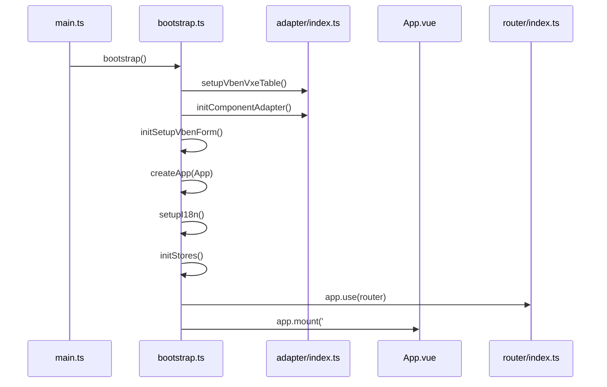
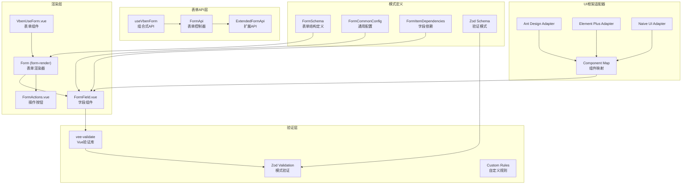
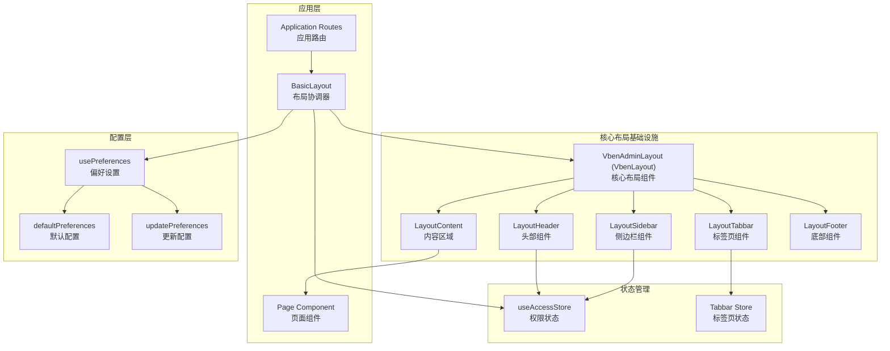
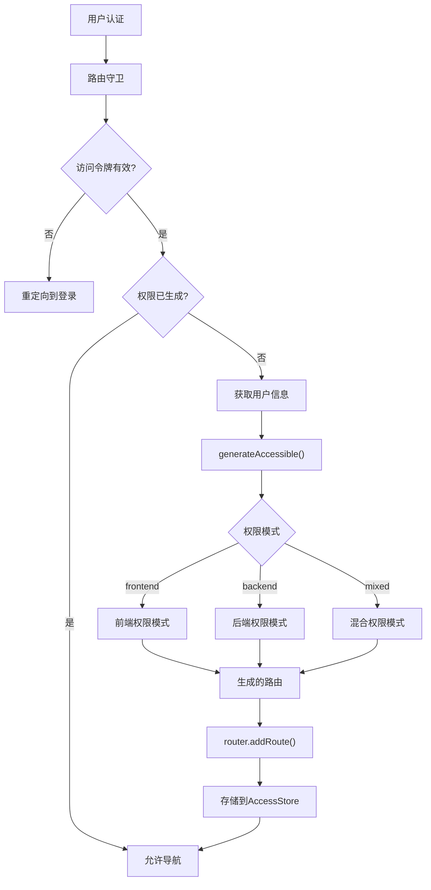
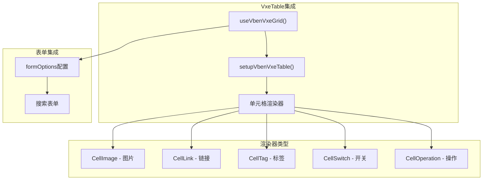
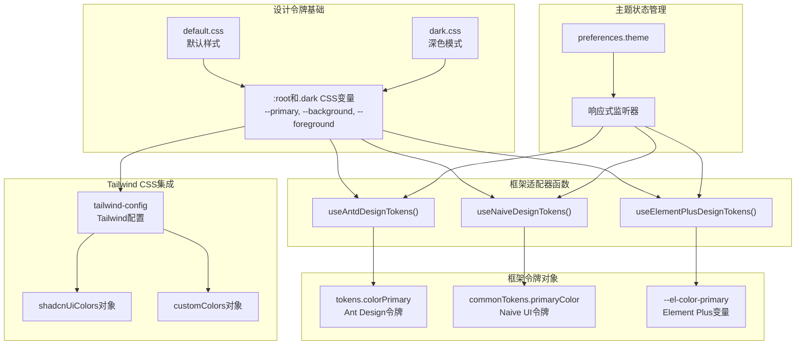

# CLAUDE.md

This file provides guidance to Claude Code (claude.ai/code) when working with code in this repository.

## 项目概述

Vue Vben Admin v5.0 是一个基于 Vue 3、Vite、TypeScript 的现代化管理系统模板，采用 monorepo 架构，支持多种 UI 框架（Ant Design Vue、Element Plus、Naive UI）。

## 开发命令

### 基础开发

```bash
# 安装依赖
pnpm install

# 启动开发服务器（默认Naive UI）
pnpm dev

# 启动特定应用
pnpm dev:antd      # Ant Design Vue版本
pnpm dev:ele       # Element Plus版本
pnpm dev:naive     # Naive UI版本（默认）
pnpm dev:play      # Playground应用
pnpm dev:docs      # 文档站点

# 构建所有应用
pnpm build

# 构建特定应用
pnpm build:antd
pnpm build:ele
pnpm build:naive
pnpm build:play
pnpm build:docs
```

### 代码质量检查

```bash
# 运行所有检查
pnpm check

# 单独检查项
pnpm check:type      # TypeScript类型检查
pnpm check:dep       # 依赖检查
pnpm check:circular  # 循环依赖检查
pnpm check:cspell    # 拼写检查

# 代码格式化
pnpm format

# 代码检查
pnpm lint
```

### 测试

```bash
# 单元测试
pnpm test:unit

# E2E测试
pnpm test:e2e
```

### 其他工具

```bash
# 清理项目
pnpm clean

# 重新安装依赖
pnpm reinstall

# 更新依赖
pnpm update:deps

# 提交代码
pnpm commit
```

## 核心架构

### Monorepo 结构

```
apps/                    # 应用层
├── web-naive/           # Naive UI应用
├── web-antd/            # Ant Design Vue应用
└── web-ele/             # Element Plus应用

packages/                # 共享包
├── @core/              # 核心包（框架无关）
│   ├── base/           # 基础工具和类型
│   │   ├── shared/     # 通用工具函数
│   │   ├── composables/ # Vue组合式API
│   │   ├── icons/      # 图标组件
│   │   ├── typings/    # TypeScript类型定义
│   │   └── preferences/ # 偏好设置管理
│   └── ui-kit/         # UI组件库
│       ├── shadcn-ui/  # 基础组件（基于radix-vue）
│       ├── form-ui/    # 表单系统
│       ├── layout-ui/  # 布局组件
│       ├── menu-ui/    # 菜单组件
│       ├── popup-ui/   # 弹窗组件
│       └── tabs-ui/    # 标签页组件
└── effects/            # 业务逻辑包
    ├── access/         # 权限控制
    ├── common-ui/      # 通用UI组件
    ├── hooks/          # Vue钩子
    ├── layouts/        # 布局业务逻辑
    ├── plugins/        # 插件（如VxeTable）
    ├── request/        # HTTP客户端
    └── stores/         # Pinia状态管理

internal/                # 内部工具
├── vite-config/        # Vite配置
├── tailwind-config/    # Tailwind配置
├── tsconfig/           # TypeScript配置
├── node-utils/         # Node.js工具
└── lint-configs/       # 代码规范配置

scripts/                 # 构建和部署脚本
├── deploy/             # 部署相关脚本
├── turbo-run/          # Turbo运行脚本
└── vsh/                # Vue Shell工具
```

### 应用启动流程



### 表单系统架构

Vue Vben Admin 实现了统一的、模式驱动的表单管理系统，支持多种UI框架：



#### 核心特性

- **模式驱动**: 使用 `FormSchema` 对象定义表单结构、验证规则和依赖关系
- **统一验证**: 集成 `vee-validate` 和 `Zod` 进行强大的表单验证
- **跨框架适配**: 通过适配器模式支持多种UI框架
- **依赖管理**: 支持字段间的动态依赖和条件显示

### 布局和导航系统

Vue Vben Admin 提供了完整的布局和导航解决方案，由 `BasicLayout` 组件统一管理：



#### 布局特性

- **7种布局模式**: 侧边栏、顶部、混合等多种布局方式
- **响应式设计**: 支持移动端和桌面端自适应
- **偏好设置**: 用户可自定义布局、主题等配置
- **权限集成**: 与权限系统深度集成，动态显示菜单

### 权限控制系统

实现了灵活的多模式权限控制，支持三种权限模式：



#### 权限模式

- **frontend**: 权限硬编码在前端，适合角色固定的系统
- **backend**: 通过API动态生成路由，适合复杂权限系统
- **mixed**: 结合前端和后端方式的混合模式

#### 细粒度权限控制

- `AccessControl` 组件：声明式权限检查
- `v-access` 指令：指令式权限控制
- 基于角色或权限码的权限验证

### VxeTable 集成架构



### 主题和样式系统

基于CSS自定义属性（设计令牌）的统一主题系统，支持多UI框架：



#### 主题特性

- **16种内置主题**: 支持多种颜色主题，包括light和dark模式
- **设计令牌**: 语义化的CSS变量，如 `--primary`、`--background`、`--foreground`
- **框架适配**: 自动将设计令牌转换为各UI框架的主题系统
- **Tailwind集成**: 扩展Tailwind的颜色调色板，支持主题响应式变化
- **实时切换**: 支持运行时主题切换，无需刷新页面

#### CSS设计令牌分类

- **Base**: `--background`, `--foreground` - 基础背景和前景色
- **Interactive**: `--card`, `--popover`, `--muted` - 交互组件背景
- **Semantic**: `--primary`, `--destructive`, `--success`, `--warning` - 语义颜色
- **Accent**: `--accent`, `--accent-hover` - 强调色和悬停状态
- **Form**: `--input`, `--border`, `--ring` - 表单相关样式
- **Layout**: `--sidebar`, `--header`, `--menu` - 布局组件样式

## 关键配置文件

### 环境配置

- **`.env` 文件**: 环境变量配置，支持 `.env`、`.env.development`、`.env.production`
- **`VITE_` 前缀**: 客户端可见变量，会嵌入到构建产物中
- **`VITE_GLOB_*`**: 特殊变量，打包时添加到 `_app_config.js`

### Vite 配置

- **`internal/vite-config/`**: 统一的Vite配置包，提供 `defineApplicationConfig()` 函数
- **`apps/*/vite.config.mts`**: 各应用的Vite配置，使用统一配置系统
- **自动导入**: 支持Vue、Vue Router、UI框架组件的自动导入
- **代理配置**: 开发环境API代理到 `http://localhost:5320`

### 包管理配置

- **`pnpm-workspace.yaml`**: 定义工作区包结构
- **`pnpm catalog`**: 统一的依赖版本管理，避免版本冲突
- **`turbo.json`**: Turbo任务定义，支持任务依赖和输出缓存
- **`.npmrc`**: pnpm配置，包括注册表设置、hoist模式等

### 代码质量配置

- **`@vben/eslint-config`**: 统一ESLint配置
- **`@vben/prettier-config`**: 统一Prettier配置
- **`@vben/stylelint-config`**: 统一样式检查配置
- **`lefthook`**: Git hooks管理，自动执行代码检查

## 开发最佳实践

### 1. 应用开发流程

- **环境准备**: 使用 Node.js >=20.10.0 和 pnpm >=9.12.0
- **优先开发**: 新功能先在 `playground/` 应用中开发和测试
- **UI适配**: 使用对应的UI框架适配器（如 `apps/web-naive/src/adapter/`）
- **组件导入**: 遵循自动导入配置，避免手动引入组件
- **样式规范**: 使用Tailwind CSS类名和设计令牌

### 2. 组件开发指南

- **核心组件**: 放在 `packages/@core/ui-kit/`，框架无关
- **业务组件**: 放在 `packages/effects/common-ui/`，包含业务逻辑
- **表单开发**: 优先使用 `useVbenForm` + Zod验证模式
- **表格开发**: 使用 `useVbenVxeGrid` + 内置渲染器
- **组件规范**: 遵循Vue 3 Composition API最佳实践

### 3. 状态管理规范

- **统一方案**: 使用Pinia进行状态管理
- **存储位置**: 存储在 `packages/stores/` 中
- **模块化**: 按业务域拆分store模块
- **组合式**: 优先使用Composition API写法
- **持久化**: 使用 `pinia-plugin-persistedstate` 处理持久化

### 4. API请求处理

- **HTTP客户端**: 使用 `@vben/request` 包的统一HTTP客户端
- **配置位置**: 在应用的 `src/api/request.ts` 中配置拦截器
- **认证处理**: 支持自动token刷新和401处理
- **错误处理**: 统一的错误消息提示和处理机制
- **类型安全**: 使用TypeScript定义API响应类型

### 5. 国际化开发

- **翻译文件**: 放在各应用的 `src/locales/` 目录
- **通用翻译**: 使用 `@vben/locales` 包的通用翻译
- **使用方式**: 在组件中使用 `$t()` 函数
- **命名规范**: 使用点号分隔的命名空间
- **动态加载**: 支持按需加载语言包

## UI框架适配详解

### Naive UI 适配

- **适配器位置**: `apps/web-naive/src/adapter/`
- **组件自动导入**: 使用 `NaiveUiResolver` 进行组件解析
- **函数导入**: 自动导入 `useDialog`、`useMessage`、`useNotification`、`useLoadingBar`
- **Vite配置**: 在 `vite.config.mts` 中配置自动导入和解析器

### Ant Design Vue 适配

- **适配器位置**: `apps/web-antd/src/adapter/`
- **样式处理**: 需要手动引入组件样式
- **主题集成**: 通过 `useAntdDesignTokens()` 适配设计令牌
- **组件映射**: 自动映射Vben组件到Ant Design组件

### Element Plus 适配

- **适配器位置**: `apps/web-ele/src/adapter/`
- **插件支持**: 使用 `unplugin-element-plus` 插件
- **主题集成**: 通过 `useElementPlusDesignTokens()` 直接更新CSS变量
- **特殊处理**: Element Plus的v-loading指令与Vben系统的兼容性处理

## 技术栈和工程化

### 核心技术栈

- **Vue 3.5+**: 使用Composition API和`<script setup>`语法
- **TypeScript 5.8+**: 严格类型检查，提升开发体验
- **Vite 7.1+**: 快速构建工具，支持HMR和优化
- **pnpm 10.14+**: 高效的包管理器，支持monorepo
- **Turbo**: monorepo构建工具，支持任务缓存和并行执行

### 工程化工具

- **ESLint**: 代码质量检查，使用Vue和TypeScript规则
- **Prettier**: 代码格式化，保持一致的代码风格
- **Stylelint**: 样式代码检查，支持CSS/SCSS
- **Vitest**: 单元测试框架，基于Vite
- **Playwright**: E2E测试框架，支持多浏览器
- **Changeset**: 版本管理和变更日志生成

## Git协作规范

### 提交规范

参考 `.github/commit-convention.md`，使用Angular约定式提交：

- **feat**: 新功能 (feature)
- **fix**: 修复bug
- **docs**: 文档更新
- **style**: 代码格式化，不影响功能
- **refactor**: 重构代码
- **perf**: 性能优化
- **test**: 测试相关
- **workflow**: 工作流程改进
- **build**: 构建系统或依赖变更
- **ci**: CI配置变更
- **chore**: 其他不涉及代码变动的修改
- **types**: 类型定义文件变更
- **wip**: 进行中的工作

### 提交格式

```
<type>(<scope>): <subject>

<body>

<footer>
```

### 分支策略

- **主分支**: `main` - 生产环境代码
- **开发分支**: `develop` - 开发环境集成
- **功能分支**: `feat/功能名称` - 新功能开发
- **修复分支**: `fix/问题描述` - bug修复
- **发布分支**: `release/版本号` - 发布准备

## 部署和构建

### 构建流程

- **Turbo构建**: 使用Turbo进行monorepo构建，支持并行和缓存
- **按需构建**: 支持按应用构建（`pnpm build:antd`）
- **分析构建**: `pnpm build:analyze` 进行构建分析
- **Docker构建**: `pnpm build:docker` 构建Docker镜像

### 部署方案

- **静态部署**: 构建产物可部署到任何静态文件服务器
- **Docker部署**: 使用 `scripts/deploy/` 中的脚本构建Docker镜像
- **多环境支持**: 通过环境变量和构建模式支持多环境部署
- **CDN优化**: 静态资源可配置CDN加速

# 项目技术文档

## 文档说明

项目的技术文档存放在 `docs/` 目录下，包含各个模块的详细使用说明和最佳实践。

### 核心系统文档

- **表单系统使用说明**: `docs/vben-form-usage.md`
  - 完整的VbenForm系统使用指南，基于vee-validate + Zod验证
  - 涵盖基础表单、字段验证、依赖管理、自定义组件等
  - 包含表单API方法、最佳实践和常见问题解决

- **模态框系统使用说明**: `docs/vben-modal-drawer-usage.md`
  - VbenModal和VbenDrawer弹窗系统详细指南
  - 支持拖拽、全屏、自动关闭等功能，与表单系统深度集成
  - 包含连接组件模式、表单弹窗、弹窗嵌套等高级用法

- **VxeTable使用说明**: `docs/vxe-table-usage.md`
  - VxeTable在项目中的完整集成和用法
  - 包含基础表格、远程数据、单元格渲染器、表单集成等
  - 涵盖树形表格、可编辑表格、性能优化等高级功能

### 文档特色

- **基于Naive UI**: 所有文档都针对Naive UI版本项目进行优化
- **实战导向**: 提供大量可直接使用的代码示例和最佳实践
- **架构解析**: 深入解析各系统的设计思路和实现原理
- **问题解决**: 收集常见问题和解决方案，提升开发效率

### 官方文档

- **项目文档**: https://doc.vben.pro/
- **在线预览**: https://vben.pro/
- **GitHub仓库**: https://github.com/vbenjs/vue-vben-admin

### 测试账号

- **用户名**: vben
- **密码**: 123456
